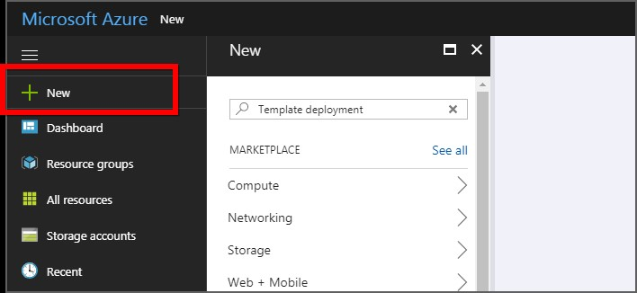
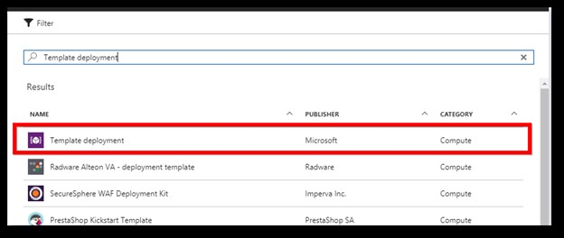
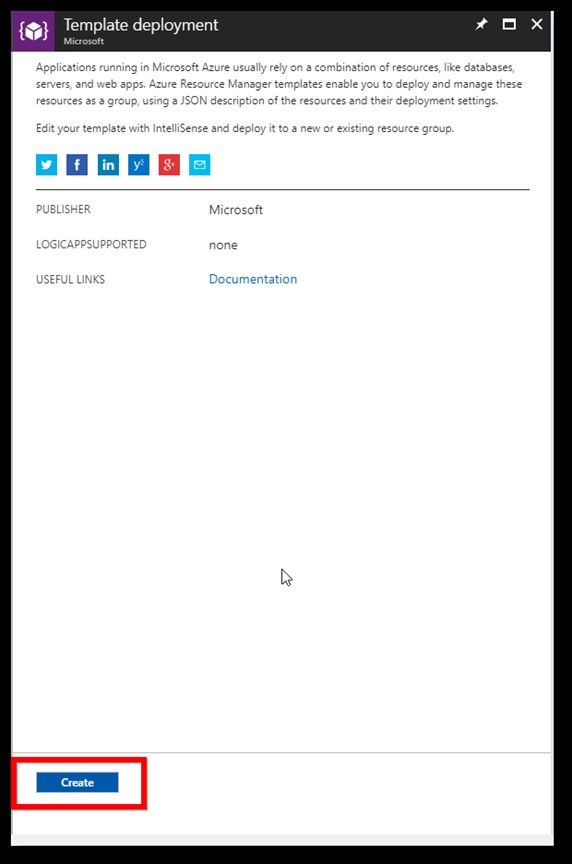
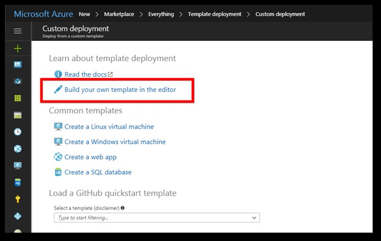
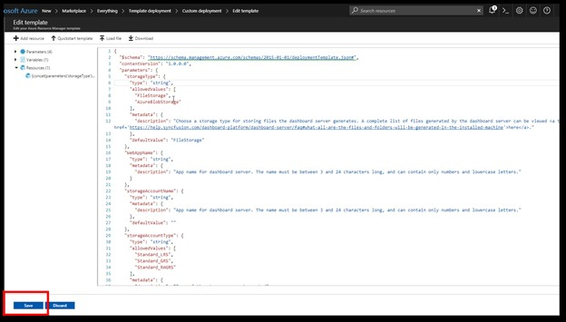
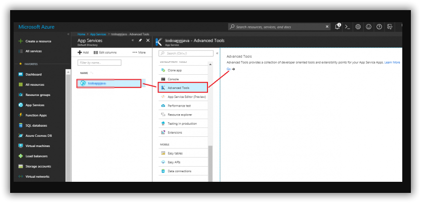
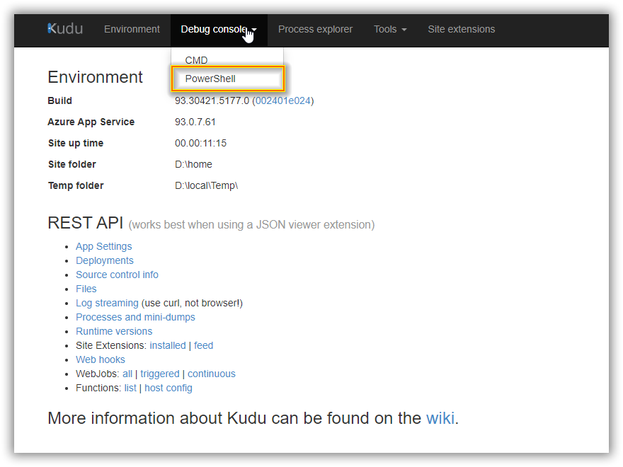
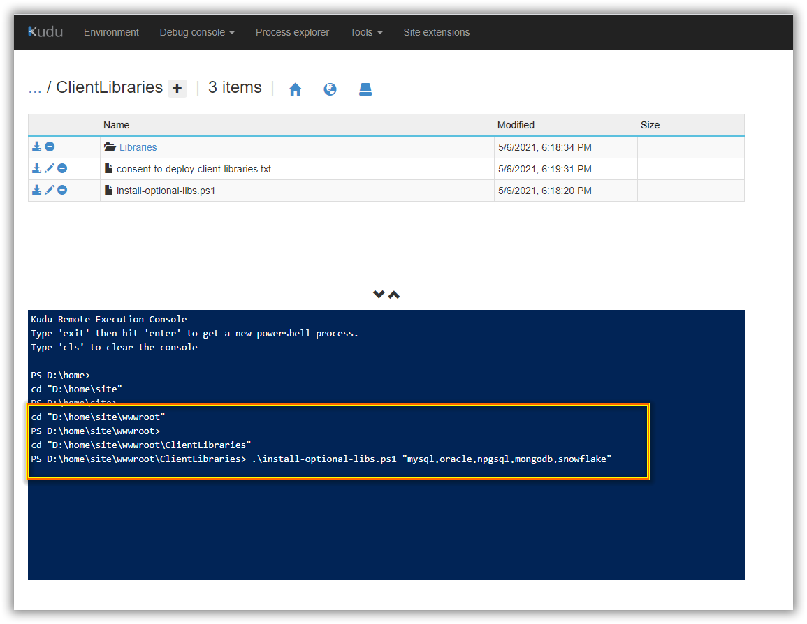

# Deploy Bold BI Enterprise Application in Azure App service
Please follow the below step to create the Bold BI Azure web app using the ARM template.
1.	Login to Azure portal: https://portal.azure.com.
    

2.	Click on the “New” in the left menu.

        

3.	Search “Template deployment” in the marketplace and select Template deployment.

          

4.	Then click on the create button.

        

5.	Now select “Build your own template in the editor” in the “Custom deployment” window.

    
    
6.	[Click here](https://raw.githubusercontent.com/boldbi/azure-arm-template/master/armtemplates/v4.1.36/BoldBIAppServiceTemplate.json) to download the ARM template file.
7.	Copy all the contents in the template file and replace them in the “Edit template” window. Then click on the save button.

    

8.	Fill the form as instructed below to complete the deployment steps.

	**Subscription**: Choose the subscription that you have with Azure. Learn more about subscriptions from [here](https://blogs.msdn.microsoft.com/arunrakwal/2012/04/09/create-windows-azure-subscription/).

	**Resource group**: This is a logical group in Azure to group your resources like a web app, storage account, network, etc. Learn more about resource groups [here](https://docs.microsoft.com/en-us/azure/azure-resource-manager/resource-group-overview#resource-groups).
	
    **Location**: Choose the location on which your app to be deployed. “East US” is our recommended location.
	
    **Storage Type**: Bold BI Web App stores the resources either in File storage or in Blob storage. Choose a storage type for storing files the Report Server generates. A complete list of files generated by the Report Server can be viewed [here](https://help.syncfusion.com/bold-bi/on-premise/setup/application-startup#storage-type-1). (For upgrade Select File storage).

	**Web App name**: This is the name of the Bold BI App that you want to have in the URL. As this is going to be the URL, it should be unique globally. The deployment process will get failed if this is present already and you will need to start once again with another name.
    
    **Storage account name**: This is optional if you have chosen File storage in Storage type and mandatory for Blob storage. This also must be unique as that of the Web App name. Learn more about storage accounts [here](https://docs.microsoft.com/en-us/azure/storage/common/storage-account-overview).

	**Storage account type**: This is optional if you have chosen File storage in Storage type and mandatory for Blob storage. Learn more about storage account types [here](https://docs.microsoft.com/en-us/azure/storage/blobs/object-replication-overview).

    Click the agreement checkbox and click on the purchase to deploy the Bold BI web app.
    

9.	Bold BI Azure App service(web app) deployment gets started.
10.	We have created an app service plan for the web app which will be in “Basic – B1” by default. Learn more about App service plans [here](https://docs.microsoft.com/en-us/azure/app-service/azure-web-sites-web-hosting-plans-in-depth-overview). Bold BI web app does not support Free or Shared app service plans.
Bold BI supports Basic, Standard, and Premium App Service plans in the Azure. The minimum recommended App Service plan to run the application is the Basic plan.
To get better performance, can scale up the App Service plan from Basic to Standard or Premium plans. Please find the below documentation links on how to scale up and scale out the App Service plan.

Scale-up: https://docs.microsoft.com/en-us/azure/app-service-web/web-sites-scale

Scale-out: https://docs.microsoft.com/en-us/azure/monitoring-and-diagnostics/insights-how-to-scale

# Install Client libraries 

Bold BI Enterprise Edition uses client libraries such as Oracle, MySQL, Snowflake, and MongoDB to connect with their respective SQL database variants. You need to read and accept client library license to install client libraries. 

Please follow the below step to install client libraries.  

1. Open kudu PowerShell console for Bold BI Azure App service. We can access the Kudu service through the portal by navigating to Web App dashboard > Advanced Tools > Click on Go. 

  

2. Select PowerShell console  


 

3. Go to client library location 

               {drive}\home\site\wwwroot\ClientLibraries 

4. Here, you can see the client library consent document consent-to-deploy-client-libraries.txt. Read client libraries LICENSE details and execute the following command to install client libraries. 
```
  .\install-optional-libs.ps1 “npgsql,mongodb,influxdb,snowflake,mysql,oracle” 
  ```


 

